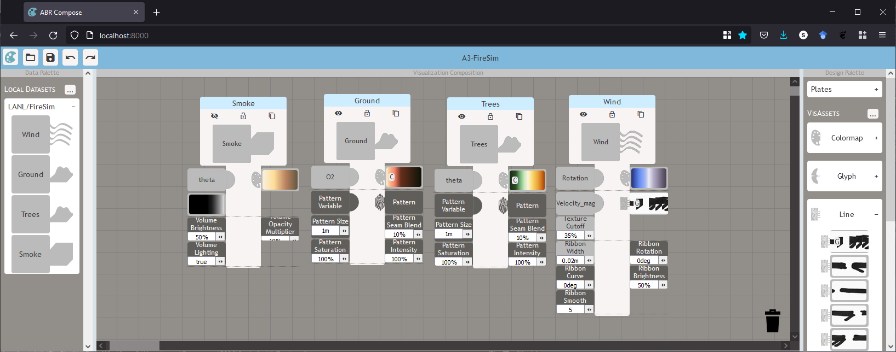

# Creating your first ABR Visualization with the ABR Design Interface

Often, the most effective way to create a visualization is visually! So, we've
provided a way to create visualizations using a drag-and-drop approach: The ABR Design Interface (ABR Compose).

If you haven't already, please follow all the instructions in
[installation instructions](./install.md) to install the ABREngine Unity
Package, design interface and visualization manager before continuing.

> [!NOTE]
> This tutorial assumes that you have completed the setup steps shown in the
> @abr-vis-app.md tutorial.

## Part 1: Checking the ABREngine GameObject and configuration

Verify that the ABREngine GameObject is in your scene, and that the
"ABRConfig_VisApp" is selected as the ABR Configuration:

## Part 2: Verifying the design interface connection

1. Ensure the ABR Server is running as described in the @abr-vis-app.md tutorial.

2. In a browser, go to <http://localhost:8000> to open the Design Interface.

3. In Unity, press the Play button. You should see the following output or similar:

## Part 3: Next Steps

1. Import some VisAssets (see videos below)
2. Creating a visualization (see videos below)
3. Optionally, follow the @importing-data.md tutorial to load additional data besides the example dataset.
4. Optionally, follow the @creating-cs-abr-vis.md tutorial to learn how to create a visualization in ABR using C# code in Unity.

> [!video https://www.youtube.com/embed/pmawi3QpxE8]

> [!video https://www.youtube.com/embed/OBgYQBr20uE]

> [!NOTE]
> These videos were created with an older version of ABR so the interface looks
> slightly different. However, the processes remain much the same!