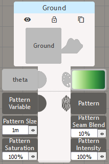

# Data Impressions

Every "layer" in the visualization is represented by a data impression. In the ABR design interface, each impression is shown by a "tower"; for example this data impression represents the ground's surface in the simulation, and we've applied some scalar data variables and styling to it.



ABR has four types of data impressions:

| @IVLab.ABREngine.SimpleSurfaceDataImpression | @IVLab.ABREngine.SimpleLineDataImpression | @IVLab.ABREngine.SimpleGlyphDataImpression | @IVLab.ABREngine.SimpleVolumeDataImpression |
| --- | --- | --- | --- |
|  |  |  |  |


## Using Data Impressions in Code

To construct a data impression, use the KeyData, Variables, and VisAssets that you have loaded in in the previous examples and link them into the data impression by assigning to instance variables like `keyData`, `colormap`, `colorVariable` etc. See the documentation links above for the values that can be changed for each Data Impression. For example, to create the same effect as the "tower" in the previous image, we might use code like this:

```cs
// Import ground data
KeyData groundData = ABREngine.Instance.Data.ImportRawDataset(...);

// Import the colormap
ColormapVisAsset cmap = ABREngine.Instance.VisAssets.LoadVisAsset<ColormapVisAsset>(...);

// Create a new data impression for the ground
SimpleSurfaceDataImpression ground = new SimpleSurfaceDataImpression();
ground.keyData = groundData;
ground.colormap = cmap;
ground.colorVariable = groundData.GetScalarVariable(...);

// Register the data impression with the engine
ABREngine.Instance.RegisterDataImpression(ground);
```